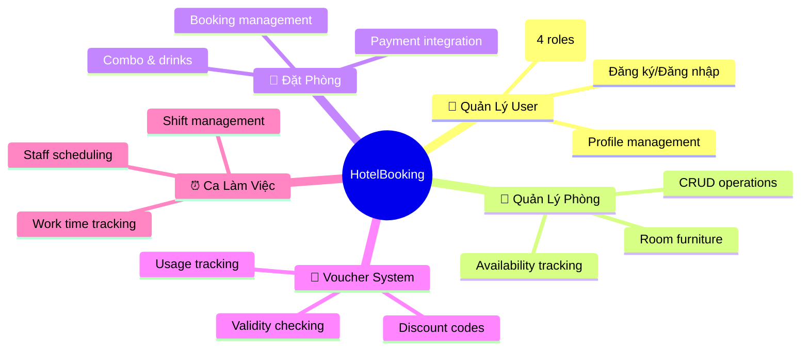
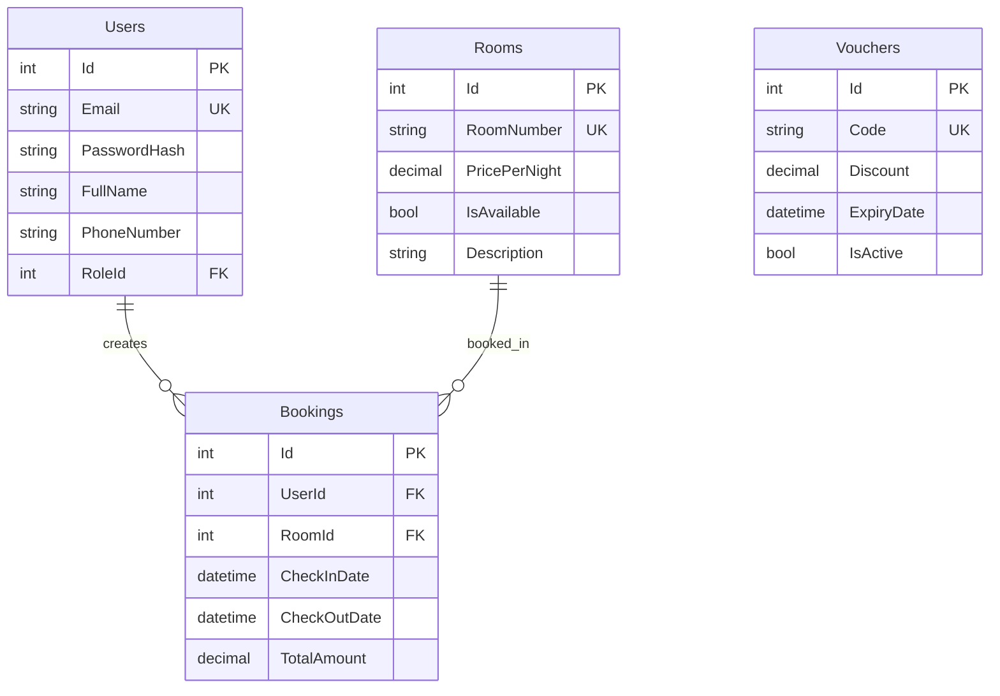

# 🏨 Hệ Thống Backend Đặt Phòng Khách Sạn

<div align="center">

**🎯 Dự án cá nhân**: Hệ thống API Backend cho ứng dụng đặt phòng khách sạn trực tuyến  
**⚡ Công nghệ**: ASP.NET Core 8.0 | Entity Framework Core | SQL Server

[](https://dotnet.microsoft.com/)
[](https://docs.microsoft.com/en-us/dotnet/csharp/)
[](https://www.microsoft.com/en-us/sql-server)
[](https://opensource.org/licenses/MIT)

</div>

---

## 📖 **Tổng Quan Dự Án**

**HotelBooking Backend** là hệ thống API RESTful hiện đại được phát triển với **ASP.NET Core 8.0**, cung cấp đầy đủ các chức năng backend cho ứng dụng đặt phòng khách sạn chuyên nghiệp. Dự án áp dụng **Clean Architecture**, đảm bảo tính mở rộng, bảo trì và hiệu suất cao.

<div align="center">

### 🎓 **Thông Tin Học Tập**

| Thông tin | Chi tiết |
|-----------|----------|
| **👤 Sinh viên** | Lê Trần Đăng Khoa |
| **🆔 MSSV** | **21DH113775** |
| **🏫 Trường** | Đại Học Ngoại Ngữ Tin Học TP.HCM |
| **📚 Khoa** | Công nghệ Thông tin |

</div>

---

## ✨ **Điểm Nổi Bật**

<table>
<tr>
<td width="50%">

### 🏗️ **Kiến Trúc & Thiết Kế**
- ✅ **Clean Architecture** với Dependency Injection
- ✅ **SOLID Principles** & Design Patterns
- ✅ **Repository Pattern** cho Data Access
- ✅ **Code Quality** cao với best practices

</td>
<td width="50%">

### 🔒 **Bảo Mật & Hiệu Suất**
- ✅ **JWT Authentication** với role-based authorization
- ✅ **BCrypt** cho mã hóa mật khẩu
- ✅ **Entity Framework Core** Query Optimization
- ✅ **FluentValidation** cho input validation

</td>
</tr>
</table>

---

## ⚡ **Tính Năng Chính**

<div align="center">



</div>

---

## 🛠️ **Stack Công Nghệ**

<div align="center">

| Lớp | Công nghệ |
|-----|-----------|
| **🎯 Backend Framework** | ASP.NET Core 8.0, C# 12.0 |
| **💾 Database** | SQL Server 2019+, Entity Framework Core |
| **🔐 Authentication** | JWT Bearer Tokens, BCrypt |
| **✅ Validation** | FluentValidation, Data Annotations |
| **📋 Documentation** | Swagger/OpenAPI 3.0 |
| **🔧 Tools** | AutoMapper, Dependency Injection |

</div>

---

## 📋 **Yêu Cầu Hệ Thống**

<table>
<tr>
<td width="50%">

### 🖥️ **Development Environment**
- **.NET SDK**: 8.0+
- **Visual Studio**: 2022 (Community/Professional)
- **SQL Server**: 2019+ hoặc LocalDB
- **Git**: Để version control

</td>
<td width="50%">

### 💻 **Hardware Requirements**
- **RAM**: 8GB+ (khuyến nghị 16GB)
- **Storage**: 5GB+ free space
- **CPU**: Intel i5+ hoặc AMD Ryzen 5+
- **OS**: Windows 10/11, macOS, Linux

</td>
</tr>
</table>

---

## 🚀 **Hướng Dẫn Cài Đặt**

### 📥 **Bước 1: Clone Repository**
```bash
git clone https://github.com/21dh113775/HotelBooking.git
cd HotelBooking
```

### 📦 **Bước 2: Cài đặt Dependencies**
```bash
dotnet restore
```

### ⚙️ **Bước 3: Cấu hình Database**

Tạo file `appsettings.json`:
```json
{
  "ConnectionStrings": {
    "DefaultConnection": "Server=(localdb)\\MSSQLLocalDB;Database=HotelBookingDB;Trusted_Connection=True;"
  },
  "JwtSettings": {
    "Key": "YourSecretKeyMustBeAtLeast32CharactersLong!@#$%",
    "Issuer": "HotelBookingAPI",
    "Audience": "HotelBookingClient"
  }
}
```

### 🗄️ **Bước 4: Chạy Database Migration**
```bash
dotnet ef migrations add InitialCreate
dotnet ef database update
```

### ▶️ **Bước 5: Khởi động Ứng dụng**
```bash
dotnet run
```

<div align="center">

🎉 **Truy cập Swagger tại**: `https://localhost:<port>/swagger`

</div>

---

## 🔌 **API Endpoints**

<div align="center">

### 🔐 **Authentication APIs**

| Method | Endpoint | Mô Tả | Authentication |
|--------|----------|-------|----------------|
| `POST` | `/api/auth/register` | Đăng ký tài khoản mới | ❌ Không |
| `POST` | `/api/auth/login` | Đăng nhập, nhận JWT token | ❌ Không |
| `GET` | `/api/auth/profile` | Xem hồ sơ người dùng | ✅ JWT |
| `GET` | `/api/auth/admin-only` | API chỉ dành cho Admin | ✅ JWT (Admin) |

</div>

### 💡 **Ví dụ API Calls**

<details>
<summary>🔵 <strong>Đăng ký tài khoản</strong></summary>

```bash
curl -X POST https://localhost:<port>/api/auth/register \
-H "Content-Type: application/json" \
-d '{
  "fullName": "Nguyen Van A",
  "email": "user@example.com", 
  "phoneNumber": "0123456789",
  "password": "Password@123",
  "role": "Customer"
}'
```
</details>

<details>
<summary>🟢 <strong>Đăng nhập</strong></summary>

```bash
curl -X POST https://localhost:<port>/api/auth/login \
-H "Content-Type: application/json" \
-d '{
  "email": "user@example.com",
  "password": "Password@123"
}'
```
</details>

---

## 🗄️ **Cấu Trúc Database**

<div align="center">

### 📊 **Database Schema**



</div>

### 📋 **Bảng Chính**
- **👥 Users**: Lưu thông tin người dùng (Email, PasswordHash, RoleId)
- **🏨 Rooms**: Lưu thông tin phòng (RoomNumber, PricePerNight, IsAvailable)
- **📅 Bookings**: Lưu thông tin đặt phòng (UserId, RoomId, CheckInDate, TotalAmount)
- **🎫 Vouchers**: Lưu mã giảm giá (Code, Discount, ExpiryDate)
- **🪑 RoomFurniture**: Bảng trung gian cho quan hệ nhiều-nhiều

### 🎯 **Dữ liệu Mẫu**
- **👨‍💼 Tài khoản Admin**: `admin@hotel.com` / `Admin@123`
- **🏷️ Vai trò**: Admin, Manager, Staff, Customer
- **🪑 Nội thất**: TV Samsung, Bàn làm việc
- **🎫 Voucher**: Mã `GIAM10` (giảm 10%)

---

## 👨‍💻 **Hướng Dẫn Development**

### 🔄 **Migration Commands**
```bash
# Tạo migration mới
dotnet ef migrations add <TênMigration>

# Cập nhật database
dotnet ef database update

# Remove last migration
dotnet ef migrations remove
```

### 🧪 **Testing APIs**
- **Swagger UI**: Tích hợp sẵn trong development
- **Postman**: Import collection từ Swagger export
- **Thunder Client**: Extension cho VS Code

---

## 🚀 **Triển Khai Production**

### ☁️ **Cloud Platforms**
- **Azure**: App Service + Azure SQL Database
- **AWS**: EC2 + RDS
- **VPS**: FPT Cloud, Viettel Cloud

### 🐳 **Docker Deployment**

<details>
<summary><strong>Dockerfile Configuration</strong></summary>

```dockerfile
FROM mcr.microsoft.com/dotnet/aspnet:8.0 AS base
WORKDIR /app
EXPOSE 80
EXPOSE 443

FROM mcr.microsoft.com/dotnet/sdk:8.0 AS build
WORKDIR /src
COPY ["HotelBooking.csproj", "."]
RUN dotnet restore "./HotelBooking.csproj"
COPY . .
WORKDIR "/src/."
RUN dotnet build "HotelBooking.csproj" -c Release -o /app/build

FROM build AS publish
RUN dotnet publish "HotelBooking.csproj" -c Release -o /app/publish

FROM base AS final
WORKDIR /app
COPY --from=publish /app/publish .
ENTRYPOINT ["dotnet", "HotelBooking.dll"]
```
</details>

### 🏗️ **Build & Run Commands**
```bash
# Build for production
dotnet publish -c Release

# Build Docker image
docker build -t hotel-booking-backend .

# Run container
docker run -p 8080:80 hotel-booking-backend
```

---

## 🤝 **Đóng Góp Dự Án**

<div align="center">

### 📝 **Quy trình Contribute**

</div>

1. **🍴 Fork** repository này
2. **🌿 Tạo branch** mới: `git checkout -b feature/tinh-nang-moi`
3. **💾 Commit** thay đổi: `git commit -m "✨ Thêm tính năng mới"`
4. **📤 Push** lên branch: `git push origin feature/tinh-nang-moi`
5. **🔄 Mở Pull Request** trên GitHub

### 📋 **Coding Standards**
- Tuân thủ **C# Coding Conventions**
- Sử dụng **meaningful variable names**
- Viết **XML documentation** cho public methods
- **Unit tests** cho business logic

---

## 📄 **Giấy Phép**

<div align="center">

Dự án được cấp phép theo **MIT License**.  
Xem file [LICENSE](LICENSE) để biết thêm chi tiết.

</div>

---

## 👨‍🎓 **Thông Tin Tác Giả**

<div align="center">

<table>
<tr>
<td align="center">
<br />
<sub><b>Lê Trần Đăng Khoa</b></sub><br />
<sub>21DH113775</sub>
</td>
</tr>
</table>

### 📫 **Liên Hệ**
- **✉️ Email**: [lekhoale30092003@gmail.com](mailto:lekhoale30092003@gmail.com)
- **🐙 GitHub**: [@21dh113775](https://github.com/21dh113775)
- **💼 LinkedIn**: [Lê Trần Đăng Khoa](https://linkedin.com/in/letrandangkhoa)

</div>

---

<div align="center">

**🌟 Nếu dự án này hữu ích, hãy cho một Star! ⭐**

Made with ❤️ by **Lê Trần Đăng Khoa**

</div>
